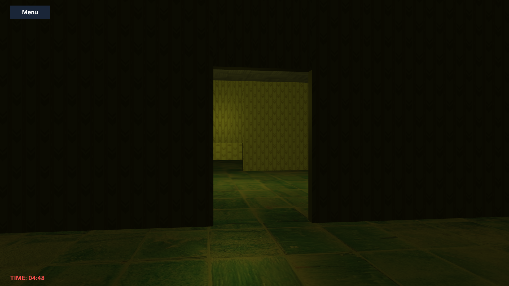
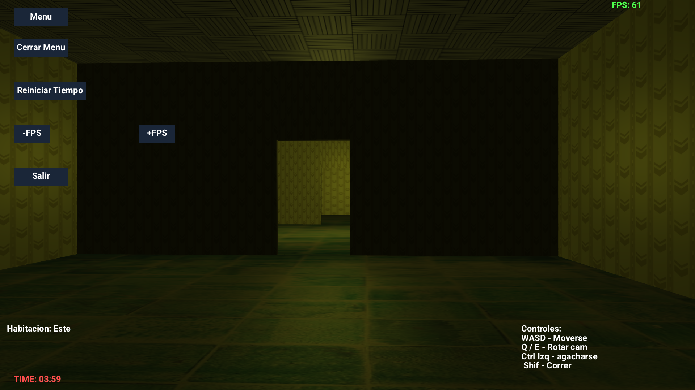
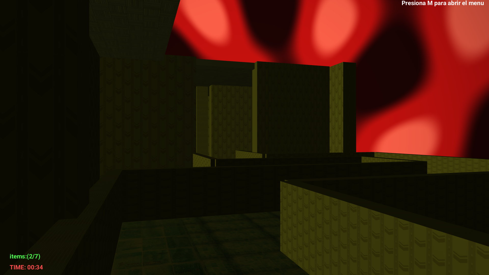

# Luminal Scape

  

---

## Key Words  
3D Graphics, OpenGL, Java, LWJGL, Game Development, Real-time Rendering, Collision Detection, Audio Integration, Interactive Environment

---

## Introduction  
Luminal Scape is an immersive 3D exploration game built entirely in Java using LWJGL. It exemplifies key concepts in graphics programming such as shader usage, dynamic lighting, texture mapping, and collision detection, all wrapped in a modular, scalable design.

Navigate interconnected rooms with smooth controls and enjoy an audio atmosphere that enhances immersion. Whether you're a student or an enthusiast, this project is a solid foundation for understanding modern OpenGL in Java.

---

## Features  
- Real-time 3D rendering with OpenGL  
- Modular room design for flexible environment building  
- Collision detection for realistic player movement  
- Dynamic lighting and shader effects  
- Integrated ambient and positional audio  
- Intuitive GUI for FPS control and timer display  
- Fullscreen toggle and responsive window resizing

---

## Screenshots  
Here are some glimpses of the game environment:

  
  
  

---

## Author  
Bryan Maradiaga  

---

## License  
This project is under the MIT License. Feel free to use, modify, and distribute with proper attribution. See the LICENSE file for details.

---

## How to Run  
1. Ensure Java 11+ is installed  
2. Clone this repository  
3. Build with your preferred IDE or tool  
4. Run the `Main` class  
5. Controls:  
   - **WASD** to move  
   - **Q/E** to rotate camera  
   - **Left Ctrl** to bend
   - **shif** to run 
     
6. Press **F11** to toggle fullscreen

---

Enjoy exploring Luminal Scape — where light and code meet in a dynamic 3D world!
